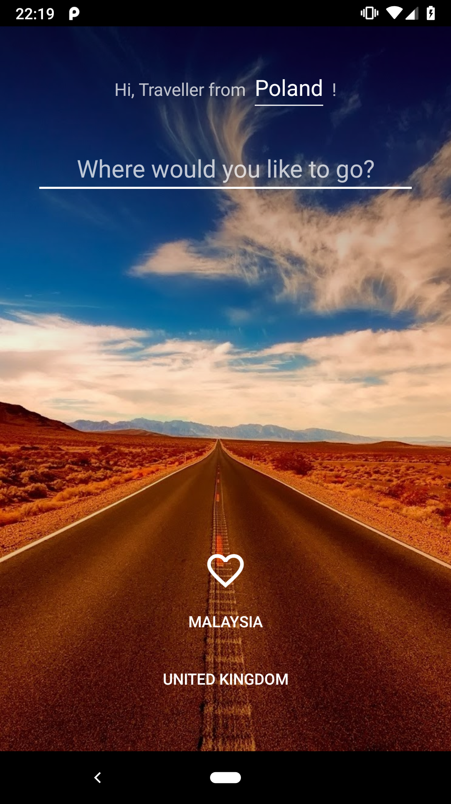
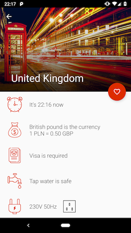
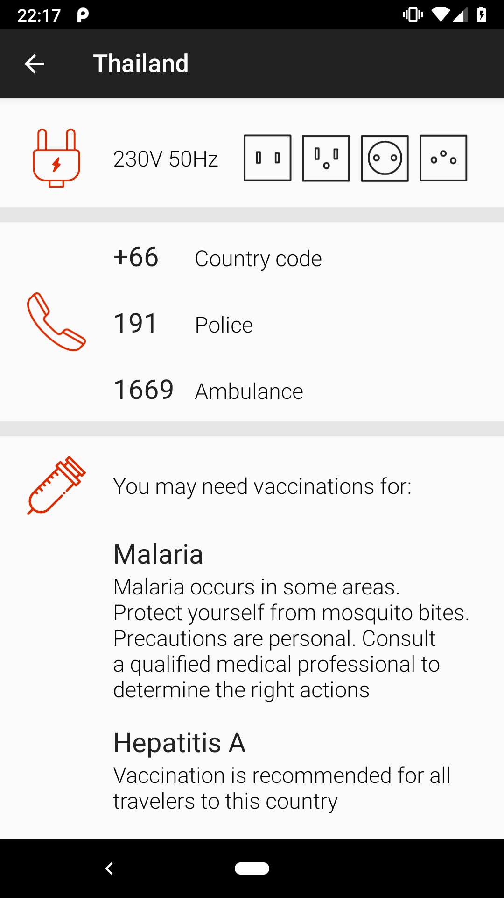

Check It, Travel Kit
=========================
When I was a digital nomad, crucial travel information like visa requirements, vaccinations needed, and whether the local tap water was safe to drink, were what I needed to know while planning my travels. There is no single website to quickly access all of these useful information about the countries I'm travelling to, and while travelling, I could not always count on having internet access. So, I decided to create an app for this purpose. 

The app is simple, but is ready to scale. It shows a modern approach to developing an Android app using MVVM architecture and Jetpack components. 

Screenshots
-----------

Libraries Used
--------------
* [Data Binding][0] for binding observables with UI elements.
* [LiveData][1] for reactive style programming.
* [Navigation][2] for in-app navigation.
* [WorkManager][3] for managing background jobs.
* [Room][4] for local storage.
* [Koin][5] for dependency injection.
* [Retrofit][6] for REST api communication.
* [Moshi][7] for JSON deserialization.
* [Glide][8] for image loading.
* [Lottie][9] for splash animation.
* [Crashlytics][10] for crash reports.
* [Binding collection adapter][11] for binding collections to recyclerviews.
* [Timber][12] for logging.
* [Espresso][13] for UI tests.
* [Mockito-Kotlin][14] for mocking in tests.
* [Kluent][15] for fluent assertions.
* [Robolectric][16] for painless unit testing.
* [MockWebServer][17] for testing HTTP clients.

[0]: https://developer.android.com/topic/libraries/data-binding/
[1]: https://developer.android.com/topic/libraries/architecture/livedata
[2]: https://developer.android.com/topic/libraries/architecture/navigation/
[3]: https://developer.android.com/topic/libraries/architecture/workmanager/
[4]: https://developer.android.com/topic/libraries/architecture/room/
[5]: https://github.com/InsertKoinIO/koin
[6]: https://github.com/square/retrofit
[7]: https://github.com/square/moshi
[8]: https://github.com/bumptech/glide
[9]: https://github.com/airbnb/lottie-android
[10]: https://fabric.io/kits/android/crashlytics/
[11]: https://github.com/evant/binding-collection-adapter
[12]: https://github.com/JakeWharton/timber
[13]: https://developer.android.com/training/testing/espresso/
[14]: https://github.com/nhaarman/mockito-kotlin
[15]: https://github.com/MarkusAmshove/Kluent
[16]: https://github.com/robolectric/robolectric
[17]: https://github.com/square/okhttp/tree/master/mockwebserver

TODO
-----------------
* More unit tests for repository
* Integration tests using Robot pattern
* Keep an eye on the bug fix https://issuetracker.google.com/issues/111316656
